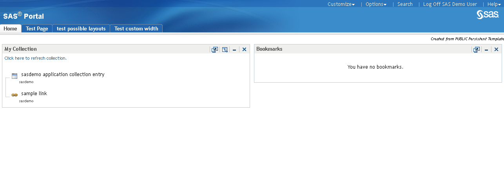
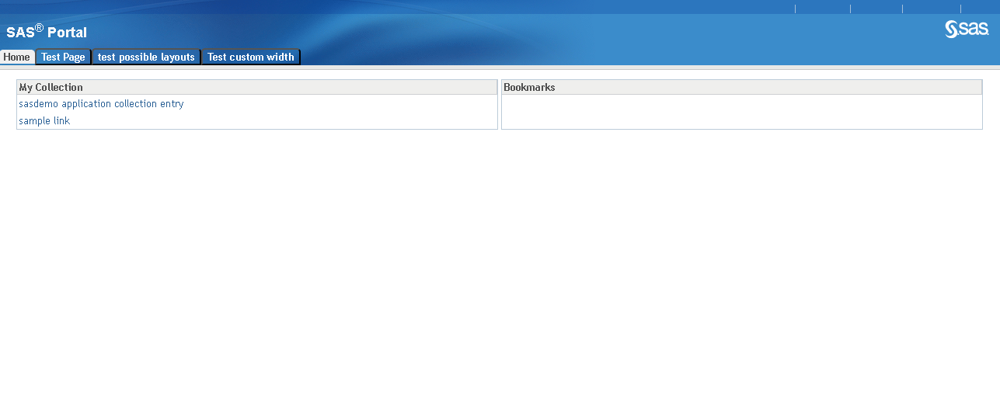

# sas-portal-app

SAS Portal App

## Description

The purpose of this project is to provide a partial replacement for SAS Information Delivery Portal, that was deprecated as of SAS 9.4M8.  

Existing Information Delivery Portal

New SAS Portal App

It is not intended to be a full replacement, but will focus on:

- rendering pages similar to the layout that was previously supported
- most widely used portlets and capabilities that do not require java server side rendering of content.

This is very much a work in progress... See the [Roadmap](#roadmap) section for more details.

## Overview

This application has 2 main parts:

- a html and simple java script web page front end
- a set of SAS Stored Processes that will render the SAS Information Delivery Portal content.

This architecture was chosen for the following reasons:

- limited security vulnerability exposure
- existing technology (SAS Stored Process) that is well understood
- SAS Stored Processes already run code as the client end user identity, so security and authorization of portal content is already covered
- simple installation

Other goals of this implementation are:

- Enter configuration information in as few places as possible
- Keep the content needing to be deployed to the webserver minimal, so that updates are mostly to the back end Stored Processes

## Installation

- git clone this repo onto your SAS environment

### SAS Stored Processes

#### SAS Stored Process Metadata

As a SAS Administrator, import the packages/sas-portal-app-services.spk file either through SAS Management Console or through the CLI.
  - By default, the package will be installed into /System/Applications/SAS Portal App
  - When importing:
    - Select a SAS Application Server Context to run the stored process
        - NOTE: The stored process server definition that is chosen must have sufficient capacity to support the scale of the number of users that you expect to use the application.
        - It may be desirable to create a new SAS Application Server Context for running this application, this will allow you to control access, scale and configuration separate from other uses.
        - **NOTE:** If your users will be running their browsers in languages that contain characters outside of the latin1 character set, you will need to make sure the Stored Process Server is running with an encoding of UTF-8.
    - When mapping the source code directory, create a new Source Directory that maps to the relative path in the input package.
#### Server Context File System Directory

In the SAS Application Server Context file system directory that is related to the Server context selected in the mapping step:
  - cd to the directory, ex:
<pre>
    cd /opt/sas/SASConfig/Lev1/SASPortalContext
</pre>
  - Make the contents of this repo directory available to this server context by either:
    - Create a symlink, SASPortalApp, to the repo directory, for example:
      - <pre> ln -s /Data/sas-portal-app SASPortalApp </pre>
    - Copy the repo directory to this directory
      - <pre> cp -r /Data/sas-portal-app/ SASPortalApp </pre>
    - **NOTE:** Regardless of which process is followed, the directory in the server context directory **MUST** be called **SASPortalApp**!

  - Modify the appserver_autoexec_usermods.sas file
<pre>%inc "SASPortalApp/sas/autoexec.sas";</pre>

- **NOTE:** If your stored process server instances are already running, you will need to restart them to pick up the appserver_autoexec_usermods.sas updates.

### Web Application

**NOTE:** There is currently an assumption built into the references to SASStoredProcess web application in this application that it can be reached via the same root url (ie. host:port) as this application is deployed to.

#### Deploy Application

Getting the application on to your web server can be done by copying files to your web server.

- under the htdocs directory of your web server, create a new directory, ex. SASPortalApp
- copy the contents of the web directory of the git repo into this directory
  <pre>cp -r this repo directory/web/* SASPortalApp</pre>
- copy the file setup.js.template as setup.js in your directory under htdocs
- verify the information defined in that file
  - sasjsAppLoc = If you have chosen to import the package into a different location than the default of _/System/Applications/SAS Portal App_, then you will need to modify the path in sasjsAppLoc

## Additional Configuration Customization (Optional)

There may need to be, or a desire to, customize the configuration.  These may include server side or web server side customizations.

### Server Side Customizations

The following scope of customizations can be implemented on the SAS Application Server side:

- specific changes to a SAS Application Server Context
  - Copy the file sas/SASPortalApp_autoexec_usermods.sas.template as SASPortalApp_autoexec_usermods.sas in the root directory of your Server Context, ex.
<pre>
  cd /opt/sas/SASConfig/Lev1/SASPortalContext
  cp SASPortalApp/sas/SASPortalApp_autoexec_usermods.sas.template SASPortalApp_autoexec_usermods.sas
</pre>
- changes that are common to all SAS Application Server Contexts that link to this repo directory
  - Copy the file sas/autoexec_usermods.sas.template as sas/autoexec_usermods.sas in the repo directory.
<pre>
  cd /Data/sas-portal-app/sas
  cp autoexec_usermods.sas.template autoexec_usermods.sas
</pre>

- changes that are run on each stored process request/execution.
  - Copy the file sas/request_setup_usermods.sas.template as sas/request_setup_usermods.sas in the repo directory.
<pre>
  cd /Data/sas-portal-app/sas
  cp request_setup_usermods.sas.template request_setup_usermods.sas
</pre>
  - **WARNING:** putting customizations into the request level setup can adversely impact response times so it should be done with caution.

#### Example Customizations

##### Using a different Metadata Location for the imported Stored Processes

- If for some reason you need to change the location that the Stored Processes were imported into metadata (default=/System/Applications/SAS Portal App), you will need to make the following changes:
  - Set the appLoc location for the stored processes in one of the locations defined above. Example:
    - <pre>%let appLoc=/System/My Applications/SAS Portal App;</pre>
    The file chosen to be updated will be dependent on the required scope to which this change should apply to.
  - **NOTE:** If this value is changed, the corresponding change must be made in the web server install for sasjsAppLoc!

- **NOTE:** If your stored process server instances are already running, and you make changes to either SASPortalApp_autoexec_usermods.sas or autoexec_usermods.sas, you will need to restart the server instances to pick up the changes.

##### Set a different default Theme

- One can force the use of a specific SAS Theme by setting the sastheme macro variable for the SAS Stored Processes.

  - For example, to change the SAS theme that will be used to one called "mycompanytheme", add the following code:
    <pre>
    %global sastheme;
    %let sastheme=mycompanytheme;
   </pre>

   to one of the files listed above.

- **NOTE:** If your stored process server instances are already running, and you make changes to either SASPortalApp_autoexec_usermods.sas or autoexec_usermods.sas, you will need to restart the server instances to pick up the changes.

### Web Server Side customizations

The following scope of customizations can be implemented on the web application side:

- Changes to the styles used to render the pages:
  - To make these types of changes:
    - edit the setup.js file and set the CSSOverrides variable to the location and name of your CSS file, ex.css_usermods.cs
    - create the file referenced in the CSSOverrides variable and define your CSS values to modify
- Changes to processing
  - To make these types of changes:
    - edit the setup.js file and set the JSOverrides variable to the location and name of your javascript file, ex. javascript_usermods.js
    - create the file referenced in the JSOverrides variable and define your javascript settings/functions

#### Example Customizations

TODO...

## Administration

There are several different aspects of administration that is required to successfully manage this functionality long term.

### Onboarding new users

By default, only users who have previously logged into the existing SAS Information Delivery Portal will be able to use this Portal implementation.

If a user had never logged into the existing SAS Information Delivery Portal, they will initially get an error message stating that the administrator has not created their portal content area.

There are 2 steps to onboarding a new user to be able to use this Portal Application.

1. [Create the user's portal content area](#create-the-users-portal-content-area)
2. [Initialize the user's portal content area with content](#initialize-the-users-portal-content-area)

**NOTE:**  In the SAS Information Delivery Portal product, this content area creation and intialization was done automatically on first user logon.  Thus, this process is a change from existing SAS Information Delivery administration processes.

#### Create the user's portal content area

There are 2 processes that can be implemented to create the user's portal content area:

1. A Batch process that creates the portal content area for all registered metadata users
2. A process that only creates the portal content area based on attempt to use the portal

While #1 is the most straightforward, and may be the best user experience, it may have a significant downside if care is not taken. This might result in a significant amount of metadata being created for users that will never log in to the Portal, thus having the potential to impact response times for actual portal users. Thus, this approach would only be appropriate in the following situations:

- Very small environments (ie. a small number of users)
- Environments where the vast majority of users defined to the system will be Portal users
- Environments where a concrete list of users can be defined

##### Batch Creation of user's portal content area

As noted above, batch creation of the users' portal content areas can have a significant negative impact on the system if care is not taken.  However, when appropriate, the portal content areas can be initialized in a batch mode.

See the [Batch User Portal Area Creation Sample](sas/SASEnvironment/SASCode/Samples/managePortalUsers/create-portal-user-area-batch/README.md).

##### On-Demand Creation of user's portal content area

As mentioned above, when a user is new they will initially get an error message stating that the administrator has not initialized their portal content area.

To change this behavior, the administrator can implement the 'create portal user area' user exit.  In this user exit, the following can be implemented:

- create the user (although this has some security requirements to be careful with)
- place a request for user registration to be fulfilled by a batch or triggered process

There are a few sample implementations of this exit in the [Samples](sas/SASEnvironment/SASCode/Samples/managePortalUsers/create-portal-user-area-plugins/README.md) directory.
 
#### Initialize the users' portal content area

Initializing their portal content area with content is executed when the user first logs into the portal and their portal content area has been created.  This will create an initial set of content for the user, based on previously defined templated content.
 
**NOTE:** Currently, this functionality is controlled by the feature flag, INITNEWUSER. See [Feature Flags](#feature-flags) for more information on how to set this flag while it is being developed.

### Creating Shared Content

One of the primary portal features is for a portal content administrator to create content that is meant to be shared with a group of users.  Each time the user logs in to the portal, there is a check performed to see if new content has been created to be shared with this user and if new content exists, the user's portal content area will be synchronized with this new shared content.

**NOTE:** Currently, this functionality is controlled by the feature flag, SYNCUSER. See [Feature Flags](#feature-flags) for more information on how to set this flag while it is being developed.

### Deleting Shared Content

When content is shared to users, the content is linked into each of the user's, or group's, content area.  Each content area has it's own set of permissions.  Once this linkage occurs, the original shared content can no longer be deleted in it's entirety from the system by a normal user, including a content administrator.  A SAS Administrator, who has un-fettered access to the metadata, will have to do the final removal.

The content administrator is still responsible for initiating the deletion of the content by selecting Remove Page, and then selecting **Remove and permanently delete this page**. This step will mark the page for deletion and is no shown to any user in the system.  However, the content still exists and should be cleaned up.

A [Delete Marked Pages SAS Job](sas/SASEnvironment/SASCode/Jobs/admin/deleteMarkedPages.sas) is provided for the administrator to delete the content from the system.

## Usage

In your web browser, go to the URL that matches where you installed the application onto your web server, ex. /SASPortalApp.

If you are not already logged in to your SAS Environment, you should be redirected to a logon prompt and/or your single signon should execute to log you in.

**NOTE:** Currently only the Collection Portlet has it's contents rendered.  All other portlet types just create a named, empty placeholder in the layout.

## Support

Use the Issues section of this repo to check for existing known issues, as well as to report new issues.

## Feature Flags

As potentially breaking or significant new features that may need additional field validation is required before turning them on by default, the feature will be enabled via setting a Feature Flag. A Feature Flag is set by setting a SAS Macro variable in one of the autoexec or request_setup customization points described above.  If the macro variable exists at all, ie. %symexist(variable) returns 1, then it is assumed to be turned on.

Features initially protected by a Feature Flag are either:
- intended to be turned on by default in a future release 
- OR to be dropped completely
based on user feedback.  

| Feature Description | Feature Flag | Introduced | Final Disposition | Date of Final Disposition |
| ------ | ------ | ------ | ------ | ------ |
| [Initialize New User](IMPLEMENTATION.md#new-users)  |  INITNEWUSER | 15NOV2023  | Included | 01FEB2024 |
| [Sync shared content](IMPLEMENTATION.md#synchronizing-shared-content-with-users)  |  SYNCUSER | 15NOV2023  | Included | 01FEB2024 |
 
## Roadmap

The intent for this application is to provide a level of functionality that was included in SAS Information Delivery Portal.  However, it is never going to be intended to be a full replacement.

Here is the list of functionality included in the SAS Information Delivery Portal.  Any input on what functionality needs to be supported is welcome.  This table will be updated as the plans and functionality requirements solidify.

### Legend

The following legend is used for each of the tables below.

| Value | Definition |
| ------ | ------ |
|  available | support for this is already available |
|    yes    | this is planning on being supported       |
|  tbd      | this is being considered for support       |
|  no       | no support for this item is currently planned |
|  N/A      | this column is not application to this row |
|  <number>      | See the numbered item in the notes following that table |

### Custom Themes support

It is understood that many customers have created a custom theme and used this with the SAS Information Delivery Portal.  

For reference, here is the SAS Documentationg page that describes defining and deploying a new theme: https://go.documentation.sas.com/doc/en/bicdc/9.4/bimtag/p1i3y59kfgz9ygn1ft7ykjjt120x.htm.

Here are the capabilities of the custom theme support and their roadmap.

| Activity | Method | Support |
| ------ | ------ | ------ |
|  Change colors  |  Change existing key value | yes  |
|  Change graphics | Replacing existing file | yes   |
|  Change graphics | Change File attribute in VTL image entry | no   |
|  Change Theme Templates |  Edit template files | no   |

### Toolbar Support

The existing SAS Information Delivery Portal has the following capabilities in the toolbar. 

#### Tools

| Activity | Support |
| ------ | ------ |
|  Manage Subscriber Profiles      |  no      |
|   Manage Subscriptions     |    no   |
|   Manage Page History      |    no   |

#### Create New Content

| Content Type | Support |
| ------ | ------ |
|  Application      |  available      |
|   Link     |    available   |
|   Syndication Channel      |    no   |
|   Portlet                  |    available  |
|   Page                     |    available  |

#### Preferences

| Category | Setting | Support |
| ------ | ------ | ------ |
|  General | User Theme      |  tbd      |
|  General | Email Notifications | no    |
|  General | Alert Notifications | no    |
|  Regional | User Locale        | tbd   |
|  Regional | Timezone           | tbd   |
|  Format   | Date Formats (Date/Time) | tbd |
|  Format   | Date Formats (Long Date) | tbd |
|  Format   | Date Formats (Short Date) | tbd |
|  Format   | Date Formats (Time) | tbd |
|  Format   | Currency (Negative Values) | tbd |
|  Format   | Currency (Currency Symbol) | tbd |
|  Portal   | Preferred Navigation | tbd |
|  Portal   | Package Sort Order | no |

#### Search

| Category | Setting | Support |
| ------ | ------ | ------ |
| By Keyword | | available 1 |
| By Content Type | Application | tbd |
| By Content Type | File | no |
| By Content Type | Link | no |
| By Content Type | Package | no |
| By Content Type | Page | 1vailable  |
| By Content Type | PageTemplate | no |
| By Content Type | Portlet | tbd |
| By Content Type | Publication Channel | no |
| By Content Type | SAS Information Map | no |
| By Content Type | SAS Report | tbd |
| By Content Type | SAS Stored Process | tbd |
| By Content Type | Syndication Channel | no |
| Search Results | Results Per Page | no |

1. Searching by Keyword, Name and Description is only currently supported when adding a Page to your portlet.

### Capabilities

The SAS Information Delivery Portal currently supports these categories of objects and these capabilities on each of these specific object types within that category.

| Category | Type | View | Add | Remove | Edit Properties | Edit Content |
| ------ | ------ | ------ | ------ | ------ | ------ | ------ |
| Portal Page | All | available | available | available | available | available |
| Portlet | Collection | available | available | available | available | available |
| Portlet | Report Portlet | 1 | no | available | tbd | no |
| Portlet | Report Portlet Local | 1 | available | available | yes | available |
| Portlet | SAS BI Dashboard | no | no | no | no | no |
| Portlet | SAS Collections | available | no | no | no | no |
| Portlet | SAS Diagnostics | no | no | no | no | no |
| Portlet | SAS Navigator | tbd | no | no | no | no |
| Portlet | SAS Report | 1 | tbd | no | no | no |
| Portlet | SAS Stored Process | available | available | available | available | available |
| Portlet | Shared Alerts | no | no | no | no | no |
| Portlet | URL Display Portlet | available | available | available | available | available |
| Portlet | WebDav Content | no | no | no | no | no |
| Portlet | WebDav Graph | no | no | no | no | no |
| Portlet | WebDav Navigator | no | no | no | no | no |

1. All Report portlets will show a link to the report, not the report content or a static image of the report.

### Layouts

SAS Information Delivery Portal currently supports these layouts.

| Layout Mode | # of Columns | Width | View | Edit |
| ------ | ------ | ------ | ------ | ------ | 
| By Column       |  1    | 100% | available | available |
| By Column       |  1    | Custom | available | available |
| By Column       |  2    | 100% | available | available |
| By Column       |  2    | Custom | available | available |
| By Column       |  3    | 100% | available | available |
| By Column       |  3    | Custom | available | available |
| By Grid       |  1    | 100% | tbd | tbd |
| By Grid       |  1    | Custom | tbd | tbd |
| By Grid       |  2    | 100% | tbd | tbd |
| By Grid       |  2    | Custom | tbd | tbd |
| By Grid       |  3    | 100% | tbd | tbd |
| By Grid       |  3    | Custom | tbd | tbd |

### Content Sharing

Content sharing allows a content administrator to create content that can be shared with a group of users. 

For more details on the type of content that can be surfaced and shared through the portal, see https://go.documentation.sas.com/doc/en/bicdc/9.4/biwaag/ag_pages_about.htm.

| Content Type | Subtype | Create | Synchronize | Remove |
| ------ | ------ | ------ | ------ | ------ |
| Pages  | Available | available | available | available |
| Pages  | Persistent | available | available | available |
| Pages  | Default | available | available | available |
| Page Templates | N/A | tbd | tbd | tbd |

Synchronize here refers to the concept of determining that there is a new shared content for a user and adding that content to the user's portal view.

## Differences with SAS Information Delivery Portal ##

Beyond the items marked as not available or tbd in the [Roadmap](#roadmap) section, here is a list of the major differences between the existing SAS Information Delivery Portal and this offering:

- The process for onboarding new users is different.  See [Onboarding new users](#onboarding-new-users) for more information.
- The process for deleting shared content is different.  See [Deleting shared content](#deleting-shared-content) for more information.
- Can add only 1 page or portlet at a time (previous SAS Information Delivery Portal allowed for creation of multiple at one time)
- The search syntax is slightly different.  The following is supported:
  - \* = all 
  - single words separated by spaces (search results match any of the individual words)
  - phrases, each surrounded by "" and if multiple, each phrase separated by spaces (search results match any of the phrases)

    NOTE: The SAS Information Delivery Portal allowed you to mix and match single words (not surrounded by quotes) and phrases (surrounded by quotes).  This implementation only supports either no quotes in search string or each phrase/word surrounded by quotes.

## Contributing

> We welcome your contributions! Please read [CONTRIBUTING.md](CONTRIBUTING.md) for details on how to submit contributions to this project. 

## License

> This project is licensed under the [Apache 2.0 License](LICENSE).
 
